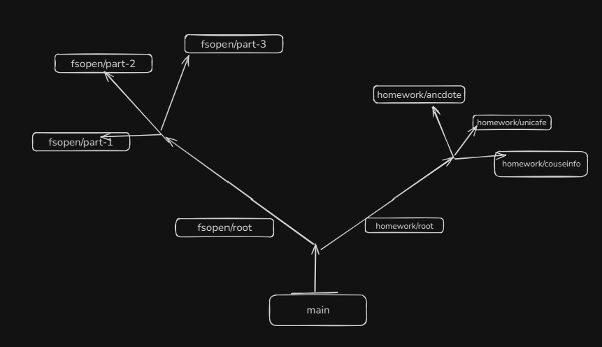

# 🧠 TIPS · NOTAS · INFORMACIÓN RELEVANTE


## 🌿 ESTRUCTURA DE RAMAS GIT


---

### 📄 Cómo se ve la estructura

```
main
├─ fsopen/root
│   ├─ fsopen/part-1
│   ├─ fsopen/part-2
│   │   └─ fsopen/part-3
└─ homework/root
    ├─ homework/courseinfo
    ├─ homework/unicafe
    └─ homework/anecdotes
```

---

### 🧭 Notas 

* **`main`** → rama principal, estable.
* **`fsopen/*`** → desarrollo de cada parte del curso.
* **`homework/*`** → ejercicios prácticos separados.
* **`homework/root`** → rama base para nuevas prácticas.

---




---

## 🟨 JAVASCRIPT

[📘 Ver guía completa de JavaScript (Variables, Funciones, Arrays, Clases, This, ...)](https://wealthy-cosmonaut-a28.notion.site/JS-24577191e5fc804ab91ed11ea864a95e?source=copy_link)

---

## 💙 TYPESCRIPT

[📘 Guía completa de TypeScript (Tipos, Variables, Funciones, Arrays, Clases, Interfaces, ...)](https://wealthy-cosmonaut-a28.notion.site/TS-29677191e5fc80d7a573d3074e0135dc?source=copy_link)

---